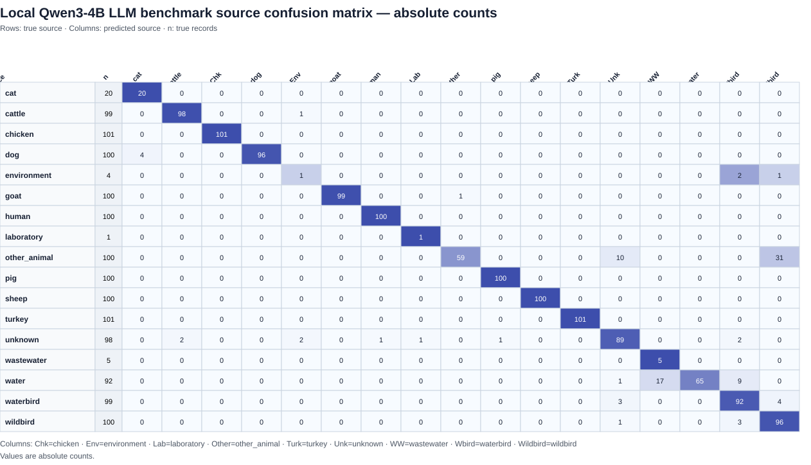
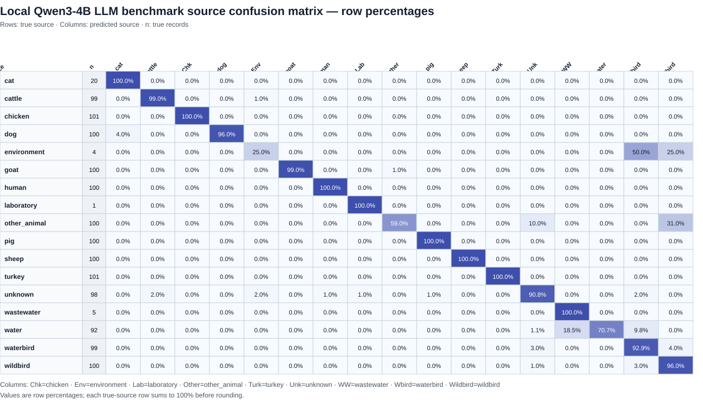

# Metadata Classification Pipeline (Zero-shot + Deterministic Parsing)

This repository contains a Python pipeline to classify biological metadata records using a combination of:

- Source/host classification with DeBERTa zero-shot NLI (default) or a local Hugging Face LLM
- Deterministic parsing (for year and country)

The pipeline is designed for large-scale datasets (e.g. ENA/SRA metadata) with heterogeneous formatting.

---
## For the impatient

If you build IKEA wardrobes without ever looking at the instructions, and you are more of a try first, read later person, here is a GPU quickstart using `--method llm`:

```bash
git clone https://github.com/aldertzomer/metalyzer.git
cd metalyzer
conda env create -f environment.yml
conda activate metalyzer
# If your Linux CUDA installation needs it: conda install -c conda-forge cuda-driver-dev=12.9
export TOKENIZERS_PARALLELISM=true
python metalyzer.py --download-taxonomy taxonomy
python metalyzer.py \
  --metadata benchmark.tsv \
  --sources sources.tsv \
  --out classified.tsv \
  --id-col run_accession \
  --device 0 \
  --method llm \
  --llm-batch-size 10 \
  --taxonomy-dir taxonomy
```

Read on for NLI on CPU or GPU, other LLM options, performance, and metrics.

## Overview

### Modular development

Metalyzer separates the pipeline into independent stages under
[`modules/`](modules/README.md): date extraction, country normalization,
deterministic source parsing (including taxonomy ID-to-scientific-name lookup),
NLI, local LLM, Mistral API, input preparation, and output combination. `metalyzer.py` contains
command-line options and stage orchestration.

Developers can start with the [module contracts and extension examples](modules/README.md)
without reading the rest of the pipeline. Typed batch/result containers in
[`modules/contracts.py`](modules/contracts.py) define row identity, source scores,
provenance, missing values, and validation. Default commands and TSV columns are
preserved. `--skip-date` and `--skip-country` disable those stages and omit their
output columns. Taxonomy is enabled with `--taxonomy-dir`; `--method nli|llm|mistral`
selects the fallback classifier, which runs only on unresolved rows.

For each metadata row, the pipeline performs:

### 1. Source classification (host taxonomy, then NLI, local LLM or Mistral)

1. If `--taxonomy-dir` is supplied, resolve explicit `host_tax_id` values using local NCBI taxonomy.
2. Unambiguous taxonomy-derived host assignments take precedence over language-model inference.
3. Only unresolved rows reach the selected backend: DeBERTa zero-shot NLI (`--method nli`, the default), a local generative LLM (`--method llm`), or the Mistral API (`--method mistral`).
4. NLI predictions below `--min-score` become `unknown`.

The zero-shot model is:

MoritzLaurer/deberta-v3-large-zeroshot-v2.0

The metadata row is converted into a structured string:

host: Gallus gallus; isolation source: neck skin; country: USA

This is evaluated against candidate labels using NLI.

---

### 2. Year extraction (deterministic)

Extracts a 4-digit year (1905–2030) from:

- collection_date
- 
- collection_date_start
- 
- collection_date_end


Supported formats:

2019

2016-04

31-12-19

15-06-18

2007-11


Handles both:

- 19YY
  
- 20YY


---

### 3. Country normalization (deterministic)

Normalizes messy country fields such as:

USA:WY

U.S.A;USA

Canada: Calgary, Alberta

United Kingdom: Oxford

to standardized country names using:

- alias mapping
  
- pycountry
  
- controlled fallback (no full-text fuzzy matching)
  

---

## Input

### Metadata table (TSV)

Get the metadata table from ENA or ATB, remove all non important columns. Put the source/host interpretable colums as 2nd, 3rd, etc columns for slightly improved performance, then save it as tab delimited file. The first column should start with "run_acc". See for an example benchmark.tsv. 

Example:

|run_acc |   host           |  isolation_source |   collection_date  |  country |
---------|------------------|-------------------|--------------------|----------|
|ERR001  |   Gallus gallus  |  neck skin        |  2019              |  USA     |

For the text sent to NLI, the local LLM, and the Mistral API, Metalyzer omits
the configured ID column, `host_tax_id`, and generic `tax_id`. The first is an
identifier; deterministic taxonomy already handles `host_tax_id`; generic
`tax_id` often names the sequenced organism rather than the sample source.
The original metadata table remains available unchanged to taxonomy, date,
country, and output processing. Other metadata fields remain in the rendered
record. Values are trimmed, CR/LF and repeated whitespace become one space,
and standard HTML entities are decoded (`&amp;` becomes `&`). Punctuation,
capitalization, and field order are preserved. The usual value and record
length limits still apply.


---

### Sources file (TSV)

Put the canonical source name first, followed by human-readable hints in parentheses.
The optional `taxonomy_anchors` column holds comma-separated NCBI Taxonomy IDs
for deterministic `host_tax_id` matching. Leave it blank when no taxon safely
identifies that source; a file containing only `source` is also supported.

| source | taxonomy_anchors |
| --- | --- |
| chicken (poultry host Gallus gallus) | 9031 |
| human (human host Homo sapiens) | 9606 |
| laboratory (artificial or synthetic sequences) | 81077,32630 |

Hints help the text classifiers distinguish similar sources. Taxonomy IDs are
configuration for the deterministic matcher only; NLI, the local LLM and the
Mistral API receive only the `source` descriptions.
The current list combines waterbirds and other wild birds under `wildbird`;
there is no separate `waterbird` output class.


---

## Output

A TSV file with:

id    <source scores...>    best_hit    source_method    source_evidence    source_llm_score    nli_verification_score    year    country

Example:

|run_acc|chicken|human|cattle|best_hit|source_method|source_evidence|source_llm_score|nli_verification_score|year|country|
|-------|-------|-----|------|--------|-------------|---------------|----------------|----------------------|----|-------|
|ERR001|0.85|0.01|0.02|chicken|nli||NA|0.93|2019|United States|

- One score column per source, named using the text before the first `(` in `sources.tsv`; multi-word names are preserved
- For NLI rows, `best_hit` is the name of the source with the highest score; ties use the first source in `sources.tsv`
- In NLI mode, `--min-score` sets the minimum top score required for `best_hit`; lower-scoring rows are labelled `unknown` while their score columns are retained. The default is `0.2`.
- Full source labels, including parenthetical hints, are still used for classification
- Short source names must be nonempty, unique, and distinct from the ID, `best_hit`, `source_method`, `source_evidence`, `source_llm_score`, `nli_verification_score`, `year`, and `country` column names
- Taxonomy-derived rows use `source_method=host_tax_id` and **all source scores are `NA`**, because no NLI inference was performed. They are not artificial probabilities and are not subject to `--min-score`.
- NLI rows use `source_method=nli`, including below-threshold `unknown` calls; their `source_evidence` is blank.
- Local LLM rows use `source_method=llm` and all per-source candidate score columns are `NA`. For valid answers, `source_llm_score` is the geometric mean probability of the generated tokens forming the label the local LLM actually produced, including `unknown`. It comes from the existing generation call, with no additional model inference or comparison against other labels. It is **not a calibrated probability that the classification is correct**. If a quoted or JSON response does not allow exact label-token isolation, its score is `NA`. Valid answers have blank evidence; malformed answers become `unknown` with `source_evidence=invalid_llm_output=...` and `source_llm_score=NA` (evidence is sanitized and truncated to 200 characters).
- Mistral API rows use `source_method=mistral` with the same `NA` score convention. `unknown` is always allowed, even when absent from the sources file. Malformed answers have `source_evidence=invalid_mistral_output=...`; request/authentication/quota failures abort instead of producing unknown labels.
- `nli_verification_score` is a separate binary NLI entailment/support score for the final assigned non-unknown source. It is `NA` for `unknown` and when `--disable-verify-source` is set.
- year as 4-digit string
- country as normalized name

Each analysis also writes a human-readable log beside its TSV: `classified.tsv`
produces `classified.tsv.log`. Version 0.2 prints the same progress and summary
messages to the terminal and records provenance in that log: command line,
local Git commit when available, Python/OS, method and model settings, input
paths, a SHA256 of `sources.tsv`, local taxonomy file paths/sizes/timestamps,
and input dimensions. The log also records classification totals and source
verification counts. Warnings appear on screen and in the log; failures exit
nonzero and leave a full Python traceback in the log. API key contents are
never logged. Logging and provenance add no columns to the classification TSV.
Check the installed release with `python metalyzer.py --version`; it exits
without analysis arguments and prints `metalyzer 0.2`.

---

### Source verification

After source classification, Metalyzer uses the same DeBERTa NLI model and
hypothesis wording as `--method nli` to test each assigned source against the
original rendered metadata. It evaluates **only one hypothesis per non-unknown
row**, using the selected source's full description from `sources.tsv`, including
its hints. The score is equivalent to zero-shot `multi_label=True` for that one
candidate. This does not rerun the full NLI classification or compare the
assigned source with alternatives. It applies to `host_tax_id`, `nli`, `llm`,
and `mistral` assignments alike.

Verification runs by default. Pass `--disable-verify-source` to skip it and
write `NA` in `nli_verification_score` for every row. An `unknown` assignment
is never scored. On NLI runs, the classifier and verifier share the loaded NLI
pipeline. On LLM and Mistral API runs, verification loads the NLI model for
non-unknown assignments, adding model memory and inference time.

---

## Installation

Requirements:

- Python ≥ 3.10
- Conda environment recommended

```bash
git clone https://github.com/aldertzomer/metalyzer.git
cd metalyzer
```

For an NVIDIA CUDA GPU, install from Conda:

```bash
conda env create -f environment.yml
conda activate metalyzer
```

`environment.yml` selects conda-forge's `pytorch-gpu`; Conda resolves the CUDA
runtime dependencies for the target system. A compatible NVIDIA driver is
required. The file lists application dependencies rather than fixing every
platform-specific package build or a user-specific installation path.

### CPU-only installation

For a machine without CUDA, create the CPU environment instead:

```bash
conda env create -f environment-cpu.yml
conda activate metalyzer-cpu
```

`environment-cpu.yml` explicitly selects conda-forge's `pytorch-cpu`
metapackage and therefore does not install CUDA, FlashAttention, or Triton.
Run the pipeline with `--device -1`.

Both specifications use Python 3.11, Transformers 5.x, PyTorch 2.x,
`mistral-common>=1.8.6`, `accelerate`, and the SentencePiece/Protobuf tokenizer
dependencies. They are environment specifications,
not exact lockfiles. Taxonomy dump parsing and downloading use the Python
standard library. The pipeline and tests use the dependencies listed in these
environments; the taxonomy feature requires no additional packages.
The API Mistral module requires the optional `mistralai` v2 SDK. It is loaded only
when unresolved rows need API inference; NLI, local LLM and taxonomy-only runs
do not require it.

On the Linux GPU server used for the local Ministral test, the CUDA build also
required `cuda-driver-dev=12.9` from conda-forge. Install it where needed with
`conda install -c conda-forge cuda-driver-dev=12.9` if needed; it is omitted
from the cross-platform environment files because CPU and Windows installations
do not use it.

To update an existing environment, use the matching command:

```bash
conda env update -n metalyzer -f environment.yml
# Or, for the CPU environment:
conda env update -n metalyzer-cpu -f environment-cpu.yml
```

An update may retain packages from an older environment. Create a fresh CPU
environment when switching from a CUDA installation.

---

## Usage

### Optional local NCBI host taxonomy

Download the [official NCBI taxonomy dump](https://ftp.ncbi.nlm.nih.gov/pub/taxonomy/)
once (network access occurs only when this command is explicitly requested):

```bash
python metalyzer.py --download-taxonomy taxonomy
```

This fetches `https://ftp.ncbi.nlm.nih.gov/pub/taxonomy/taxdump.tar.gz` and
installs `nodes.dmp`, `names.dmp`, and `merged.dmp` in `taxonomy/`. You can
also download and unpack these three files manually. Run the download command
again to refresh the local data; retain a copy of the dump for reproducible runs.

```bash
python metalyzer.py --metadata benchmark.tsv --sources sources.tsv \
  --out classified.tsv --id-col run_accession \
  --taxonomy-dir taxonomy --device -1 --batch-size 10
```

Use `--device 0` for GPU execution. Normal taxonomy lookup is entirely local:
files load once and lineages are cached. Only `host_tax_id` triggers taxonomy
classification; the sample/pathogen `tax_id` is never used as host taxonomy.
Numeric strings, integral decimal values such as `9940.0`, quoted IDs, and
obsolete IDs in `merged.dmp` are supported. Missing or invalid IDs fall back
to the selected text classifier. Omitting `--taxonomy-dir`, or supplying unreadable/malformed files,
produces a warning and uses the selected text classifier for every row.

The `taxonomy_anchors` column in `sources.tsv` controls these assignments.
Each ID maps that taxon and all its descendants to the row's source, regardless
of taxonomic rank. For each valid `host_tax_id`, Metalyzer normalizes merged IDs
and walks its lineage from the most specific taxon toward the root; the first
configured anchor wins. Thus a species anchor such as chicken (`9031`) can
override a broader Aves (`8782`) anchor, and a cat (`9685`) anchor can override
Carnivora (`33554`) in a custom vocabulary. At startup, configured anchors are
checked against the loaded taxonomy dump. Obsolete IDs are normalized and
logged; nonexistent IDs, broken lineages, or a normalized anchor assigned to
multiple sources stop the run with a configuration error. The log reports the
configured, valid, merged, invalid, and conflicting anchor counts. Blank
anchors or no matching lineage for a valid host fall back to the selected
classifier. The generic sample/pathogen `tax_id` is intentionally never source
evidence, since it often identifies the sequenced organism instead of its host.

The repository file configures domestic pig (`9825`), chicken (`9031`), turkey
(`9103`), cattle (`9913`), sheep (`9940`), goat (`9925`), human (`9606`), dog
(`9615`), and cat (`9685`). It also configures the environmental-samples node
`1936016` and artificial/synthetic sequence nodes `81077,32630`. Descendants
of a configured environmental node inherit its source; this applies to soil,
marine or air metagenome nodes only when they actually fall below that anchor
in the supplied NCBI dump. Ordinary organism taxids, such as *E. coli* `562`,
do not imply `laboratory`: a laboratory strain may have come from any source.
The broad Metazoa anchor is left blank for `other_animal` in the repository file
because it would also absorb birds and animal sources whose ecological or food
context taxonomy alone cannot establish. Custom source files can use higher-level
anchors when their classes make that inheritance appropriate. These IDs are
never passed to NLI or generative models; their source descriptions remain
unchanged.

For a sheep host, the output looks like this (all other source scores are also `NA`):

```text
run_accession   chicken turkey  pig cattle  sheep   ... best_hit source_method   source_evidence
SRR17929619     NA      NA      NA  NA      NA      ... sheep    host_tax_id     host_tax_id=9940; Ovis aries
```

Input order, year/country extraction, and NLI score column names are preserved.
Each run reports taxonomy calls, selected classifier calls, and its `unknown` calls.
LLM runs also report the number of invalid model outputs.
If all hosts resolve, the fallback classifier is not loaded. The NLI verifier
still loads for those assignments unless `--disable-verify-source` is set.

Run the offline unit and integration tests with:

```bash
python -m unittest discover -s tests -v
```

### Standard NLI usage

```bash
export TOKENIZERS_PARALLELISM=true
```

```bash
python metalyzer.py \
  --metadata benchmark.tsv \
  --sources sources.tsv \
  --out classified.tsv \
  --id-col run_accession \
  --method nli \
  --device 0 \
  --batch-size 64 \
  --min-score 0.2 \
  --taxonomy-dir taxonomy
```
---
On the current taxonomy-enabled benchmark, `--min-score 0.2` gives 85.8%
overall accuracy and 87.7% precision among records assigned a non-unknown
source. The cutoff should be rechecked for a new source list or dataset.

Use `--device 0` for the first GPU (the default), or another nonnegative GPU
index. GPU execution requires a CUDA-enabled PyTorch installation.

For CPU execution, use `--device -1`. For example, to run the benchmark:

```bash
python metalyzer.py --metadata benchmark.tsv --sources sources.tsv --out classified.tsv --id-col run_accession --device -1 --batch-size 10
```

NLI CPU execution explicitly uses float32 to avoid slow float16 inference.
GPU execution uses the model checkpoint's precision (`dtype="auto"`).

## Benchmark results

The current [`benchmark_nli.tsv`](benchmark_nli.tsv),
[`benchmark_llm.tsv`](benchmark_llm.tsv), and
[`benchmark_mistral_api.tsv`](benchmark_mistral_api.tsv) were run with local host
taxonomy enabled. All three use the updated [`sources.tsv`](sources.tsv), which combines
waterbird and wildbird into `wildbird`, and are evaluated by accession against
[`benchmark_true_labels.tsv`](benchmark_true_labels.tsv). The saved files include
`source_llm_score` and `nli_verification_score`; these are output scores, not
the recall and precision metrics below. Each run has 215 `host_tax_id`
assignments and 1,105 model assignments. Accuracy in the per-source tables is
recall: correct calls divided by true rows. Precision is correct calls divided
by called rows.

#### NLI benchmark (`--min-score 0.2`)

| Source | True rows | Called rows | Correct | Accuracy | Precision |
|---|---:|---:|---:|---:|---:|
| cat | 20 | 22 | 20 | 100.0% | 90.9% |
| cattle | 99 | 118 | 99 | 100.0% | 83.9% |
| chicken | 101 | 104 | 99 | 98.0% | 95.2% |
| dog | 100 | 100 | 100 | 100.0% | 100.0% |
| environment | 4 | 110 | 3 | 75.0% | 2.7% |
| goat | 100 | 101 | 98 | 98.0% | 97.0% |
| human | 100 | 89 | 89 | 89.0% | 100.0% |
| laboratory | 1 | 2 | 1 | 100.0% | 50.0% |
| other_animal | 100 | 56 | 54 | 54.0% | 96.4% |
| pig | 100 | 106 | 100 | 100.0% | 94.3% |
| sheep | 100 | 95 | 95 | 95.0% | 100.0% |
| turkey | 101 | 85 | 85 | 84.2% | 100.0% |
| unknown | 95 | 106 | 68 | 71.6% | 64.2% |
| wastewater | 20 | 18 | 18 | 90.0% | 100.0% |
| water | 79 | 73 | 70 | 88.6% | 95.9% |
| wildbird | 200 | 135 | 134 | 67.0% | 99.3% |

NLI makes 1,133 correct calls of 1,320 (**85.8% overall accuracy**) and
assigns a non-unknown source to 1,214 records (92.0%). Precision among those
assigned records is 87.7%. The run has 106 `unknown` predictions.

### NLI confusion matrices

Rows are true sources, columns are predicted sources, and `n` is the number of
true records in the row. For NLI rows, the `unknown` prediction is created by
the 0.2 score cutoff, not by a source candidate.

#### Absolute counts

[](assets/benchmark-confusion-absolute.svg)

The image is a full source-by-source table. Click it to inspect at full resolution.

#### Row percentages

[](assets/benchmark-confusion-percent.svg)

Each row shows the share of records with that true source assigned to every
predicted source. The SVG tables are generated from the benchmark TSV files by
`python render_benchmark_matrices.py`. The per-class
[metrics](benchmark_smoke/local_llm_evaluation/benchmark_nli_per_class.tsv),
[counts](benchmark_smoke/local_llm_evaluation/benchmark_nli_confusion_counts.tsv),
and [row percentages](benchmark_smoke/local_llm_evaluation/benchmark_nli_confusion_percent.tsv)
are available as TSV files.

### Local Hugging Face LLM classifier

`--method llm` selects local generative classification with
[`mistralai/Ministral-3-8B-Instruct-2512`](https://huggingface.co/mistralai/Ministral-3-8B-Instruct-2512)
by default. Transformers downloads the tokenizer and weights on first use and
reuses the standard Hugging Face cache on subsequent runs. Inference runs on
your machine; no API or API key is required. The existing environments contain
the required dependencies.

Taxonomy still takes precedence: only unresolved `host_tax_id` rows reach the
LLM. The LLM does not load if taxonomy resolves every row. With verification
enabled, DeBERTa also loads to score the final non-unknown assignments. The
natural-language metadata representation and
deterministic year/country processing are shared with NLI.

The same `sources.tsv` supplies canonical labels and their full descriptions.
The LLM may also answer `unknown` when source evidence is insufficient; this
does not add an `unknown` score column unless that source is in your file.
The prompt tells the model that field names alone are not source evidence and
that ambiguous or absent source values should map to `unknown`. These rules
also apply to the separate Mistral API method.
All per-source candidate score columns are `NA`. Valid LLM decisions also have
`source_llm_score`, as described in [Output](#output). `--min-score` applies
only to NLI; in LLM mode it prints an informational message and does not affect
predictions.

```bash
python metalyzer.py \
  --metadata benchmark.tsv \
  --sources sources.tsv \
  --out classified_ministral.tsv \
  --id-col run_accession \
  --taxonomy-dir taxonomy \
  --method llm \
  --llm-model mistralai/Ministral-3-8B-Instruct-2512 \
  --device 0 \
  --llm-batch-size 1
```

Use `--device 0` for the first CUDA GPU, another nonnegative index for that
specific GPU, or `--device -1` for CPU. An unavailable GPU causes a clear error
instead of silently switching devices. Omit `--taxonomy-dir taxonomy` if you
have not downloaded taxonomy.

CPU example:

```bash
python metalyzer.py --metadata benchmark.tsv --sources sources.tsv \
  --out ministral_cpu.tsv --id-col run_accession \
  --method llm --llm-model mistralai/Ministral-3-8B-Instruct-2512 \
  --device -1 --llm-batch-size 1 --taxonomy-dir taxonomy
```

For a quick test, add `--limit 10` to either command. `--limit` also works with
NLI and selects the first N metadata rows before classification.

`--llm-model` accepts another compatible Ministral 3 checkpoint;
`--llm-revision` optionally pins both tokenizer and weights to a specific
Hugging Face revision. Models are never substituted automatically. Generation
is greedy and defaults to `--llm-max-new-tokens 16`. The Mistral tokenizer
formats and pads batches of chat conversations directly.

`--llm-batch-size` defaults to 1 independently of NLI's `--batch-size 64`.
The LLM retains checkpoint precision (`dtype="auto"`) on both CPU and GPU and
loads with `low_cpu_mem_usage=True`. GPU loading uses `device_map` for the
requested GPU and requires `accelerate`; the model's Mistral tokenizer requires
`mistral-common`. The checkpoint uses FP8 weights, but actual memory includes
other weights, activations, generation cache, loading overhead and other
processes. The supplied test was run on a larger GPU server; peak memory was
not recorded. A 12-GB fit is not established. CPU execution may be slow and
may need substantially more memory.

#### Local Ministral benchmark results

The current `benchmark_llm.tsv` was generated with the default local Ministral
model, the merged `wildbird` label, and taxonomy enabled. It contains all 1,320
records: 215 `host_tax_id` assignments and 1,105 local LLM assignments. It has
92 `unknown` predictions, including one malformed response recorded as
`invalid_llm_output` evidence. The table uses the updated true labels.

| Source | True rows | Called rows | Correct | Accuracy | Precision |
|---|---:|---:|---:|---:|---:|
| cat | 20 | 20 | 20 | 100.0% | 100.0% |
| cattle | 99 | 97 | 97 | 98.0% | 100.0% |
| chicken | 101 | 108 | 101 | 100.0% | 93.5% |
| dog | 100 | 100 | 100 | 100.0% | 100.0% |
| environment | 4 | 29 | 3 | 75.0% | 10.3% |
| goat | 100 | 100 | 100 | 100.0% | 100.0% |
| human | 100 | 108 | 99 | 99.0% | 91.7% |
| laboratory | 1 | 5 | 0 | 0.0% | 0.0% |
| other_animal | 100 | 101 | 99 | 99.0% | 98.0% |
| pig | 100 | 99 | 99 | 99.0% | 100.0% |
| sheep | 100 | 98 | 98 | 98.0% | 100.0% |
| turkey | 101 | 100 | 100 | 99.0% | 100.0% |
| unknown | 95 | 92 | 74 | 77.9% | 80.4% |
| wastewater | 20 | 20 | 20 | 100.0% | 100.0% |
| water | 79 | 77 | 77 | 97.5% | 100.0% |
| wildbird | 200 | 166 | 164 | 82.0% | 98.8% |

The local Ministral run makes 1,251 correct calls of 1,320 (**94.8% overall
accuracy**) and assigns a non-unknown source to 1,228 records (93.0%). Precision
among assigned records is 95.8%.

Rows are true sources and columns are predicted sources. Click either image to
inspect the full matrix. The underlying [per-class metrics](benchmark_smoke/local_llm_evaluation/benchmark_llm_per_class.tsv),
[counts](benchmark_smoke/local_llm_evaluation/benchmark_llm_confusion_counts.tsv),
and [row percentages](benchmark_smoke/local_llm_evaluation/benchmark_llm_confusion_percent.tsv)
are also available as TSV files.

##### Absolute counts

[](assets/benchmark-llm-confusion-absolute.svg)

##### Row percentages

[](assets/benchmark-llm-confusion-percent.svg)

### Mistral API benchmark results

The current [`benchmark_mistral_api.tsv`](benchmark_mistral_api.tsv) contains all
1,320 records, with 215 `host_tax_id` assignments and 1,105 Mistral API
assignments. It uses the merged `wildbird` source and the updated true labels.
The run has 81 `unknown` predictions.

| Source | True rows | Called rows | Correct | Accuracy | Precision |
|---|---:|---:|---:|---:|---:|
| cat | 20 | 20 | 20 | 100.0% | 100.0% |
| cattle | 99 | 100 | 99 | 100.0% | 99.0% |
| chicken | 101 | 108 | 101 | 100.0% | 93.5% |
| dog | 100 | 100 | 100 | 100.0% | 100.0% |
| environment | 4 | 17 | 4 | 100.0% | 23.5% |
| goat | 100 | 100 | 100 | 100.0% | 100.0% |
| human | 100 | 102 | 100 | 100.0% | 98.0% |
| laboratory | 1 | 1 | 0 | 0.0% | 0.0% |
| other_animal | 100 | 100 | 99 | 99.0% | 99.0% |
| pig | 100 | 101 | 100 | 100.0% | 99.0% |
| sheep | 100 | 100 | 100 | 100.0% | 100.0% |
| turkey | 101 | 101 | 101 | 100.0% | 100.0% |
| unknown | 95 | 81 | 80 | 84.2% | 98.8% |
| wastewater | 20 | 18 | 18 | 90.0% | 100.0% |
| water | 79 | 71 | 69 | 87.3% | 97.2% |
| wildbird | 200 | 200 | 198 | 99.0% | 99.0% |

The Mistral API run makes 1,289 correct calls of 1,320 (**97.7% overall
accuracy**) and assigns a non-unknown source to 1,239 records (93.9%). Precision
among assigned records is 97.6%. These figures include the shared taxonomy
assignments, so they measure the complete pipeline rather than API calls alone.

---

### Mistral API module

`--method mistral` uses [`modules/mistral.py`](modules/mistral.py) with the
standard pipeline inputs and output columns. Taxonomy still takes precedence;
only unresolved rows are sent to Mistral. Date and country extraction remain
local. The API module itself does not load PyTorch, Transformers, or local model
weights; the default source verification step does load DeBERTa for non-unknown
assignments. Use `--disable-verify-source` when running without local NLI weights.

Install the optional SDK in your active environment:

```bash
conda install -c conda-forge 'mistralai>=2,<3'
```

When API access is available, start with a small run:

```bash
python metalyzer.py \
  --metadata benchmark.tsv \
  --sources sources.tsv \
  --out benchmark_mistral_modular.tsv \
  --id-col run_accession \
  --method mistral \
  --api-key-file ~/mistral.key \
  --mistral-concurrency 1 \
  --mistral-retries 0 \
  --limit 10
```

Add `--taxonomy-dir taxonomy` for a taxonomy-enabled benchmark run. The key file accepts
either the raw key or `MISTRAL_API_KEY=...` (optionally quoted). It is read only
when API requests are needed and is never included in metadata or output.

As with the local LLM, **`unknown` is always an allowed answer**. It is added
to both the prompt and the JSON schema when missing from your source list.
There is no need to edit `sources.tsv`, and no extra `unknown` score column
appears unless your file explicitly includes that source. An explicit unknown
answer has blank evidence. Invalid JSON, unexpected labels or missing responses
become unknown with sanitized `invalid_mistral_output=...` evidence (at most
200 characters after the prefix), without another paid request.

The schema follows the [official Mistral structured-output SDK example](https://github.com/mistralai/client-python/blob/main/examples/mistral/chat/structured_outputs_with_json_schema.py).
Output includes `best_hit`, `source_method=mistral`, `source_evidence`, `year`
and `country`, with all candidate scores `NA`. `--min-score` has no effect.
`--device`, `--batch-size`, and `--llm-*` configure the local backends only.

| Option | Default | Meaning |
|---|---|---|
| `--mistral-model` | `mistral-small-latest` | Model sent to the API; choose a fixed model ID for reproducibility |
| `--mistral-concurrency` | `8` | Maximum concurrent requests/worker tasks |
| `--mistral-retries` | `5` | Additional attempts for timeouts or HTTP 408/429/500/502/503/504 |
| `--mistral-timeout` | `60` | Seconds per request attempt |
| `--mistral-random-seed` | `12345` | Seed sent to Mistral |
| `--mistral-max-tokens` | `32` | Maximum generated tokens per response |
| `--mistral-progress-every` | `10` | Print progress after this many completed rows |

Retries use capped exponential backoff; SDK retries are disabled to keep the
attempt limit predictable. Authentication errors and other permanent failures
stop immediately. Exhausted retries, including quota/rate-limit errors, stop
the run and cancel remaining workers; they never become classification labels.
The output file is written only after the full run succeeds, so API failures
leave an existing output file untouched. Completed API calls may still be billed;
this module does not checkpoint/resume partial runs.

Validation uses mocked API responses, including concurrency, timeouts, retries,
taxonomy precedence and output serialization. The saved API benchmark above
reports classification accuracy for a complete run.

## Performance Notes

- Source classification runs on the selected CPU or GPU
- Year and country parsing are CPU-light
- Batch size can be increased for better GPU utilization
- current implementation has a single CPU bottleneck. 

---

## Design Rationale

Why not classify year/country with NLI?

- Year and country are usually explicitly present
- Zero-shot classification:
  - is slower
  - introduces unnecessary errors
- Deterministic parsing is:
  - faster
  - more accurate
  - reproducible

---

## Known Limitations

- Ambiguous entries like "Korea" default to "South Korea"
- Missing or noisy metadata may result in:
  - year = ""
  - country = "unknown"

---

## License

MIT License
